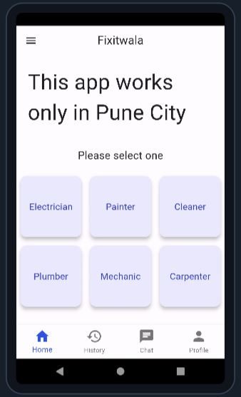
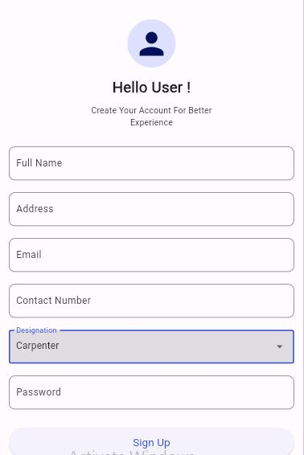
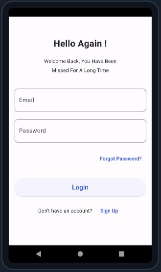
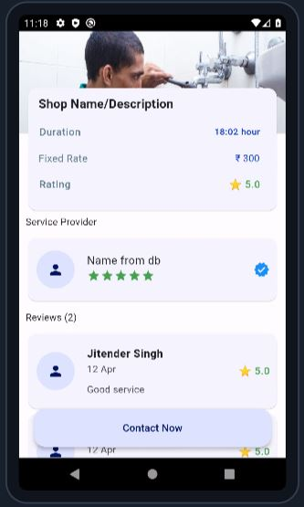
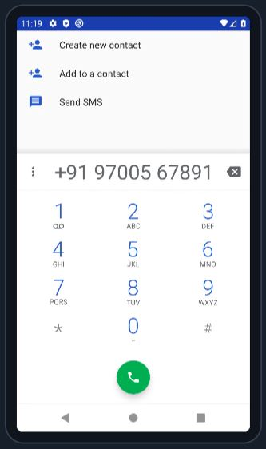
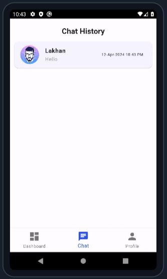

# Fixitwala - Home services app

Final project for MCA 

## Screenshots

|  |   |   |   |
| -------------------------- | -------------------------- | -------------------------- | -------------------------- |

|  |   |   |   |
| -------------------------- | -------------------------- | -------------------------- | -------------------------- |

|  |   |   |   |
| -------------------------- | -------------------------- | -------------------------- | -------------------------- |

|  |   |   |   |
| -------------------------- | -------------------------- | -------------------------- | -------------------------- |

## Getting Started

✅ TODO: add CI/CD code to build app when a branch gets merged into main branch
  

## How to solve `gradlew` file error?

- deleted `android` folder
- untracked the deleted files using git
- hit Hot Restart
- done

## How to solve flutter 3.19 issue?
> took 15 hours to solve this

- error: not able to install `apk` on emulator because of `nix` new structures

- how I solved:
    - created new project in Project IDX and pushed to GitHub 
    - cloned both projects locally
    - deleted all files and folders from old project (i.e Fixitwala) except .git folder and lib folder
    - copy pasted all remaining files and folders from new project (i.e testfixitwala) 
    - pushed to GitHub 
    - imported freshly pushed Fixitwala project to Project IDX.
    - Finally it started working.
